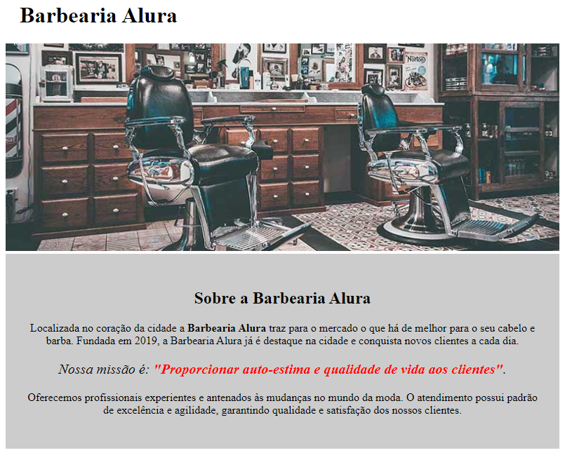

# Barbearia Alura 

>Curso de HTML e CSS da Alura

Projeto que está sendo desenvolvido durante o curso de HTML e CSS da Alura.  
O curso é dividido em 4 partes:
- Parte 1: crie um página da web;
- Parte 2: posicionamento, listas e navegação;
- Parte 3: trabalhando com formulários e tabélas;
- Parte 4: avançando no CSS.

Ao final dessas 4 partes o resultado deverá ser um exemplo de site totalmente funcional para uma barbearia, criado apenas com HTML e CSS. 

[🔗 Click aqui para acessar](https://edysilva27.github.io/NLW/)

## Etapas

- Parte 1: 100% completa
- Parte 2: 100% completa
- Parte 3: 49% completa
- Parte 4: 0% completa

## 🔧 Tecnoligias

- HTML5
- CSS